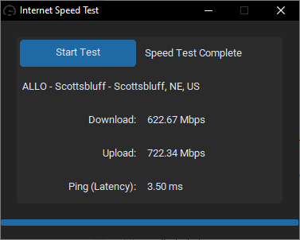
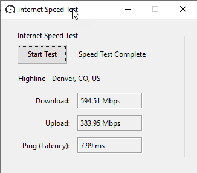

# Speed Test in Python

## Internet bandwidth tester in Python with CustomTkinter

This project leverages using ChatGPT 3.5 to build parts of an application. I started with a functional Tkinter program I created using the speed-cli Python library. I am adding and integrating features using ChatGPT 3.5 to build some of the code.

I am not using ChatGPT to build the entire program. I am using it as a coding helper. I could do the entire program manually. Using ChatGPT speeds up the developement process.

## V2 GUI

## V1 GUI

## History
08/10/2023: Added customtkinter, threading and status bar showing phases of the speedtest

## About Me
I am an Information Technology Instructor at Western Nebraska Community College. I teach Information Technology Technical Support, CyberSecurity and Computer Science.

Visit my WNCC [About Me](https://sites.google.com/view/williamaloringwncc/about-me) page.

## License
 This work is licensed under a <a rel="license" href="http://creativecommons.org/licenses/by-nc-sa/4.0/">Creative Commons Attribution-NonCommercial-ShareAlike 4.0 International License</a>.

Copyright (c) 2023 William A Loring
