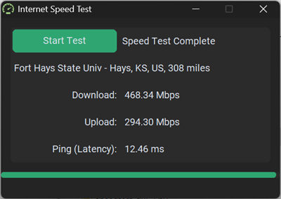

# Speed Test in Python

## Internet bandwidth tester in Python with CustomTkinter

This project leverages using ChatGPT 3.5 to build parts of an application.

I started with a functional Tkinter program I created using the speed-cli Python library. This program was the final step in a tutorial I wrote for my programming classes. [Python Speedtest Tutorial.pdf](./Python%20Speedtest%20Tutorial.pdf)

## V4 GUI

Built with customtkinter

https://customtkinter.tomschimansky.com/

## V1 GUI

## History

- 09/23/2023: V4 Choose 1 random server out of the 10 closest speedtest servers
- 08/10/2023: V3 Added customtkinter and status bar showing phases of the speedtest
- 08/10/2023: V2 Added threading to keep GUI responsive

## About Me

I am an Information Technology Instructor at Western Nebraska Community College. I teach Information Technology Technical Support, CyberSecurity and Computer Science.

Visit my WNCC [About Me](https://sites.google.com/view/williamaloringwncc/about-me) page.

## License
 This work is licensed under a <a rel="license" href="http://creativecommons.org/licenses/by-nc-sa/4.0/">Creative Commons Attribution-NonCommercial-ShareAlike 4.0 International License</a>.

Copyright (c) 2024 William A Loring
